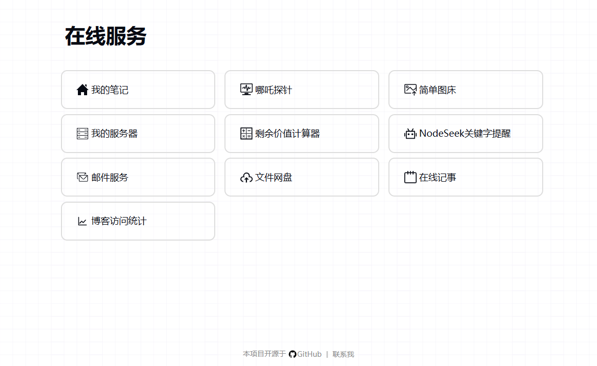

# 简洁网址导航

## 🚀项目简介

 一个简洁可配置的静态网址导航页面，帮助展示你收藏的网址。打包后为无依赖单文件，方便各种环境部署。 

## ⚡功能特点

- 简洁美观的界面
- 纯静态 HTML/CSS/JS 实现
- 使用 YML 作为配置文
- 适应不同的屏幕，电脑和手机浏览器上体验良好

## 💻在线示例

https://tools.196000.xyz

## 📷运行截图



## 📝部署使用

1. 克隆仓库

```yaml
git clone https://github.com/hahabye/zero-nav.git
```

2. 根目录文件 `config.yml` 添加或者修改站点，其格式为：

```yaml
categories:
  - name: 分类名称
    icon: 分类图标
    sites:
      - title: 网站名称
        url: 网站地址
        icon: 网站图标
        description: 网站描述

```

3. 部署到您的网站


## 📧我要反馈

[hello@196000.xyz](mailto:hello@196000.xyz)
